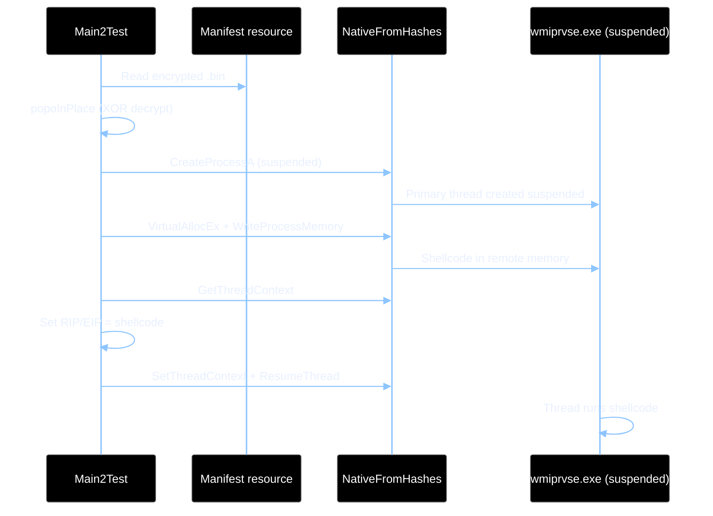

# ClickForOnceHalfClass
A Half Evasive Class for Clickonce Payloads

## Complementary Code to the BlogPost 
[(https://ndolecki.gitlab.io/posts/clickonce)](https://ndolecki.gitlab.io/posts/clickonce)

## Usage 
- Copy the class within a Hijackable .net DLL and compile it . 
- Embed the shellcode you like using the Csharp Script included within this repo.
- Recreate the Hash values for .net Execution as Described in the blogpost or other sources.
- Host your modified .application file and try it out. 

## This class was used to play around with legit Hijackablae CLickonce Payloads with a little bit of EDR evasion

## Techniques
| Category | Techniques |
|----------|------------|
| **Injection** | Thread context hijack (default), QueueUserAPC, CreateRemoteThread |
| **Staging** | Suspended sacrificial process, VirtualAllocEx + WriteProcessMemory (RWX) |
| **Evasion** | PEB walk, API hashing, dynamic delegates, XOR’d embedded payload |

## End-to-end sequence

# EDR Detection Results

|EDR Vendor |Result |Status |
|------------|--------|--------|
| Cortex | Not detected | 🟢 |
| CrowdStrike | Not detected (after bloating) | 🟢 |
| Bitdefender | Detected - malicious sacrificial process | 🔴 |
| MDE (Microsoft Defender for Endpoint) | Initial access not detected; beacon caught after memory scan | 🟡 |
| SentinelOne | Not detected | 🟢 |

**Legend:** 🟢 Not detected · 🔴 Detected · 🟡 Partial / delayed detection

